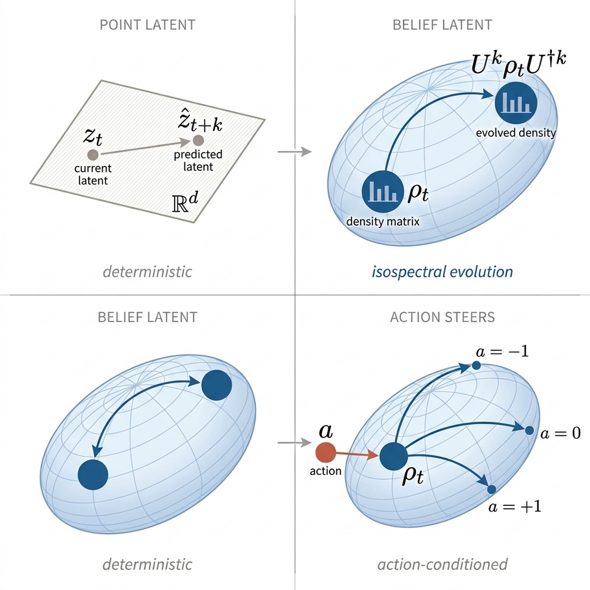

# UWM-JEPA: Predictive World Models That Imagine in Belief Space

*Unitary density-matrix latent prediction for partially observable JEPA world models.*

**Santosh Kumar Radha** &nbsp;·&nbsp; **Oktay Goktas** &nbsp;·&nbsp; AgentField AI, Toronto

<p align="center">
  
</p>

> Standard vector-latent JEPAs predict a point in representation space. UWM-JEPA represents the latent as a density matrix and rolls it forward on an isospectral orbit. Under partial observability this gives the predictor a structured latent in which uncertainty and hidden modes can be carried through blind rollout; actions steer the unitary trajectory through `H(a) = H₀ + a·H₁`.

## Abstract

World models for partially observed environments must imagine multiple compatible hidden futures and steer between them under counterfactual actions. JEPA-family world models do this in latent space, but a vector-valued latent has no internal structure for carrying the belief over hidden continuations through blind rollout. We introduce UWM-JEPA, a JEPA world model with a density-matrix latent on a joint system–environment space and a learned unitary predictor. The construction preserves the joint-state spectrum exactly during rollout, so the predictor itself cannot dissipate the represented uncertainty.

On a hidden-velocity indicator task requiring five-step forward simulation under a given action sequence with the target observation masked, UWM-JEPA reaches **0.77 accuracy** and degrades monotonically as actions are perturbed; a parameter-matched LSTM-JEPA with the same objective and action head **collapses to majority-class accuracy (0.53)** under every action condition. Under blind rollout, UWM-JEPA loses fewer than ten points of probe *R*² at short horizons while vector-latent baselines lose forty-one and sixty-eight; both nevertheless tie on a held-out context probe, locating the separation in the predictor rather than the encoder. Action sensitivity itself requires training against counterfactual rather than teacher-forced targets, a finding that applies beyond the unitary parameterisation. For JEPA world models to imagine under partial observability, **latent geometry and predictor dynamics matter, not encoder capacity alone**.

## Headline results

- **Belief-state latent** — A bipartite density matrix on a joint system–environment Hilbert space replaces the vector latent of a standard JEPA. The reduced system state is what downstream probes read; the environment factor carries hidden modes through imagined rollout.
- **Information-preserving predictor** — Unitary conjugation preserves the joint-state spectrum exactly. The predictor itself cannot collapse the represented uncertainty under blind rollout (theorem; numerical verification in Fig. S1).
- **Matched-baseline contrast** — On a hidden-velocity indicator task that requires mental-simulating five steps forward under a given action sequence with the target observation masked, UWM-JEPA-CF reaches **0.77** while a parameter-matched LSTM-JEPA-CF with the same objective and action head sits at **majority-class (0.53)** under every condition.
- **Encoder is not the explanation** — The same matched baseline ties UWM-JEPA on a five-seed held-out probe of hidden velocity (*p* = 0.70), locating the empirical separation in the predictor.
- **Counterfactual training targets** — Action sensitivity collapses under teacher-forced targets (‖H₁‖/‖H₀‖ ≈ 0.03) and is restored by counterfactual simulator-rollout targets (‖H₁‖/‖H₀‖ ≈ 1.00). The finding applies beyond the unitary parameterisation.

## Repository layout

```
uwm-jepa/
├── paper/                          # Manuscript source and final PDF
│   ├── main.tex                    # Top-level document
│   ├── main.pdf                    # Compiled paper
│   ├── preamble.tex                # Shared LaTeX preamble
│   ├── references.bib              # Bibliography
│   ├── sections/                   # Section sources
│   └── figures/                    # All figures used in the paper
│
└── experiments/                    # Figure regeneration from bundled data
    ├── README.md
    ├── make_figures.py             # Single script regenerates all evidence figures
    └── data/                       # Aggregated outputs from training/eval runs
```

## Reproducing the figures

```bash
cd experiments
python3 make_figures.py
```

This regenerates Figures 2, 3, 4 of the main text and Figures S1, S2 of the supplement from the bundled JSON/CSV under `experiments/data/`. Outputs are written as `.pdf` (used by the paper) and `.png` to `paper/figures/`.

Requires: `numpy`, `matplotlib`. Tested with Python 3.12.

## Building the paper

The paper builds with [Tectonic](https://tectonic-typesetting.github.io/) (single-binary LaTeX engine) or any standard `pdflatex` + `bibtex` toolchain:

```bash
cd paper
tectonic main.tex
```

## Citation

```bibtex
@article{radha2026uwmjepa,
  title  = {UWM-JEPA: Predictive World Models That Imagine in Belief Space},
  author = {Radha, Santosh Kumar and Goktas, Oktay},
  year   = {2026},
  note   = {Preprint. \url{https://github.com/santoshkumarradha/uwm-jepa}}
}
```

## Contact

Santosh Kumar Radha — `contact@santoshkumarradha.com` · `santosh@agentfield.ai`
